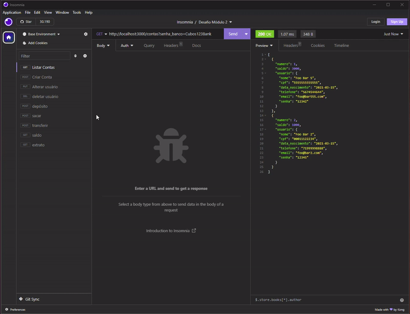
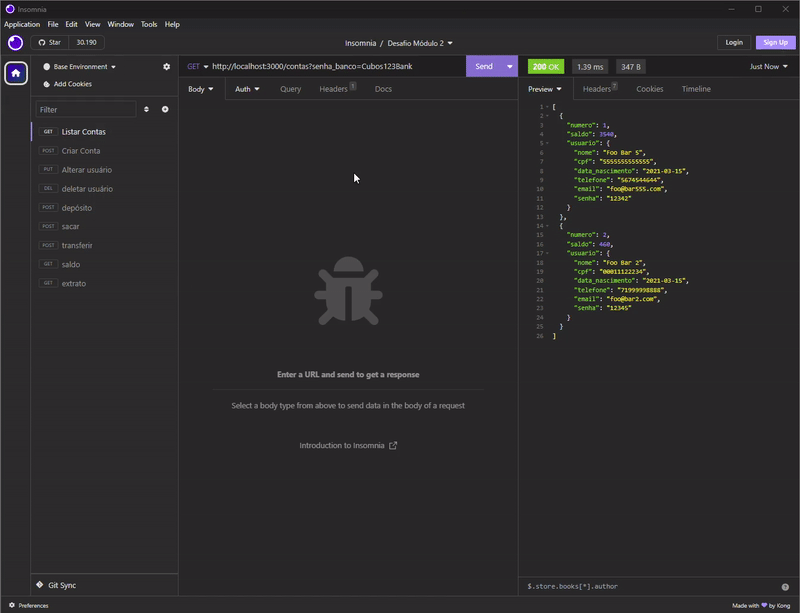
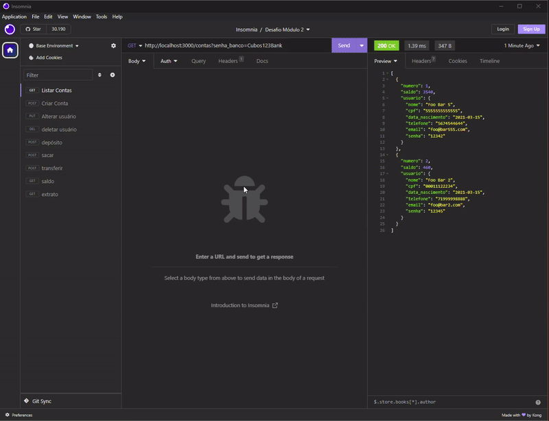

# Projeto Sistema Bancário

## Sobre:

Sistema de bancário com operações CRUD, desenvolvida com a linguagem Javascript.
Para utilizar este projeto será preciso liberar a porta 3000 (ou outra que vc prefira, mas será necessário alterar o código), e iniciar o servidor. Aqui foi utilizado o programa Insomnia para realizar os testes, mas você pode utiliza-lo direto de seu navegador utilizando os links descritos a seguir.

### Realiza as seguintes funções:

- Listar todas as contas: http://localhost:3000/contas?senha_banco=Cubos123Bank
- Criar Contas: http://localhost:3000/contas
- Alterar Usuário: http://localhost:3000/contas/1/usuario
- Deletar Usuário: http://localhost:3000/contas/2
- Depósito: http://localhost:3000/transacoes/depositar
- Saque: http://localhost:3000/transacoes/sacar
- Transferência: http://localhost:3000/transacoes/transferir
- saldo: http://localhost:3000/contas/saldo?numero_conta=1&senha=12342
- Extrato: http://localhost:3000/contas/extrato?numero_conta=1&senha=12342

 

## Listar todas as contas:

São listadas todas as contas de usuários cadastrados.  

## Criar contas:

Criada novas contas e as adiciona às contas de usuários existentes.  

## Alterar usuário:

Altera dados de usúarios já cadastrados, desde que seu cpf e e-mail não constem em outra conta.  

## Deletar usuário:

Deleta usuário cadastrado, desde que o saldo da conta seja igual a zero.  

## Depósito:

Realiza depósito para as contas já cadastradas.  

## Saque:

Realiza depósito para as contas já cadastradas.  

## Transferência:

Realiza transferência de valores entre as contas já cadastradas.  

## Saldo:

Faz conferência do saldo da conta.  

## Extrato:

Devolve, na tela, toda a movimentação feita pela conta informada.  

 

## Tecnologias utilizadas:

 

  

  
  
  
          
          

